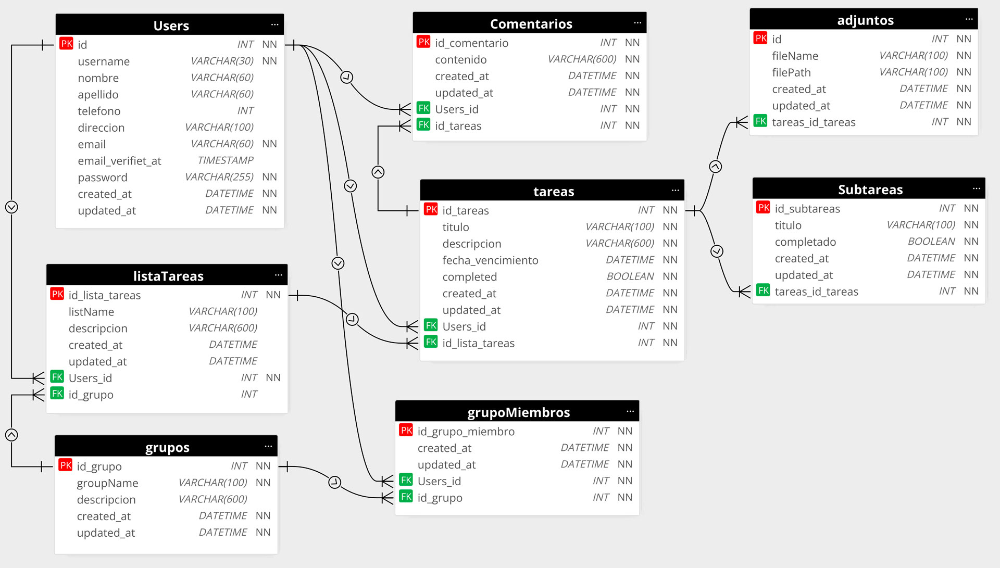
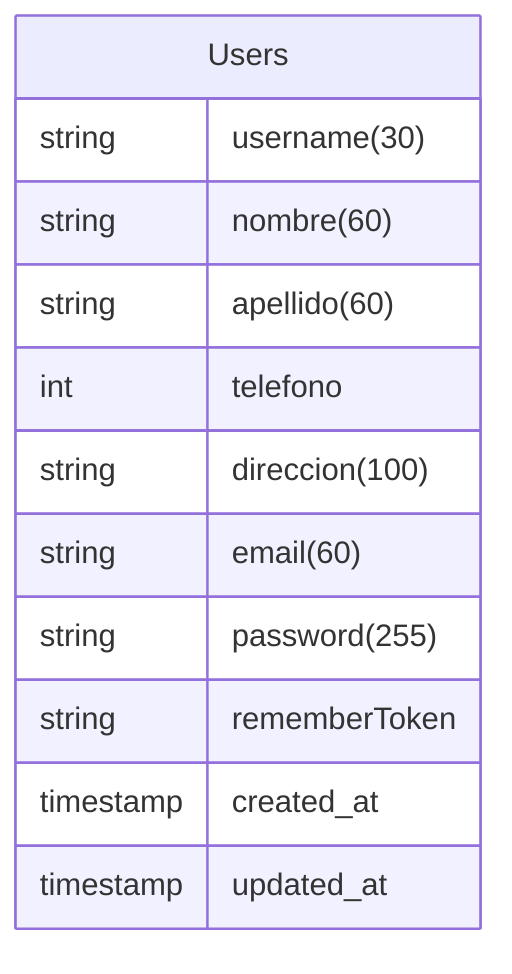
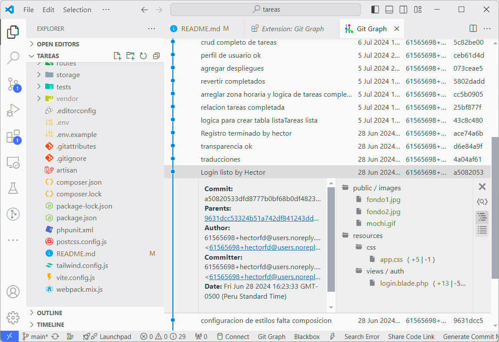

# Practica 1
<center>por: <strong>Héctor Ferro Dávalos</strong></center>

# Aplicación ToDoList o lista de Tareas

### Petición de la Practica
La aplicación es una aplicación para gestionar listas de tareas pendientes de los
usuarios de la aplicación. Se pueden registrar y logear usuarios y los usuarios
registrados pueden añadir, modificar y borrar tareas pendientes de hacer.
## Definición de Necesidades
el siguiente análisis se hizo en base al uso de aplicaciones existentes de TODOs en la red, se observo en que consiste este tipo de aplicaciones y continuación se muestra los requerimientos para nuestra aplicación de TODOs con nuestra propia abstracción
### Tabla de Requerimientos
Los siguientes requerimientos se tomaron en cuenta para el desarrollo de la aplicación, al contar con poco tiempo, se utilizara solo una iteración para poder entregar software funcional, el objetivo propuesto por el programador es el nivel 4 que cumple con la **petición de la practica**  

| Nivel | Requerimiento                                                                                                                                                                                                                    |
| ----- | -------------------------------------------------------------------------------------------------------------------------------------------------------------------------------------------------------------------------------- |
| **1** | Los usuarios deben hacer login en la aplicación, el login debe ser el username y el password.                                                                                                                                    |
| **2** | El registro debe ser libre para el usuario nuevo, los datos que se pidan serán de libertad del programador para futuros estudios de datos                                                                                        |
| **3** | El login debe contener seguridad por JWT, el token debe tener un tamaño de hasta 255 caracteres, la contraseña debe ser cifrada para que no sea visible en la base de datos                                                      |
| **4** | El TODOLIST debe contener una jerarquía, lista de tareas, tareas y subtareas, para una mejor administración                                                                                                                      |
| **5** | Las tareas pueden contener datos adjuntos, estos pueden contener diferentes tipos de archivos y multimedia.                                                                                                                      |
| **6** | las Listas de tareas pueden asociarse a grupos de trabajo en donde varios usuarios pueden trabajar juntos en una lista, la asociación debe darse por invitación del usuario dueño de la lista para una experiencia colaborativa. |
| **7** | Las tareas pueden contener comentarios como forma de comunicación entre los usuarios que participan colaborativamente en una lista

### Lenguaje de Programación
#### PHP
Según la petición la aplicación debe desarrollarse en el lenguaje de programación PHP
##### Laravel
es el framework que sera utilizado para el desarrollo de la aplicación la version que utilizaremos es Laravel Framework 10.48.12 

### Tabla de herramientas utilizadas en esta Practica

| Nro   | Aplicación                                                                             |
| ----- | -------------------------------------------------------------------------------------- |
| **1** | **IDE. Visual Studio Code:** sera utilizado para codificar la aplicación TODOLIST      |
| **2** | **Moon Modeler:** utilizaremos este entorno para el diseño ER de la base de datos      |
| **3** | **Obsidian:** para documentar esta aplicación                                          |
| **4** | **Laragon:** para lanzar y probar la aplicación gracias a su entorno de desarrollo web |
| **5** | **Navegadores web:** para visualizar la aplicación, Firefox developer, chrome y Edge   |
### Tabla de tecnologías que serán utilizadas en esta Practica                                              
| Nro   | Aplicación                                                                            |
| ----- | ------------------------------------------------------------------------------------- |
| **1** | **NODE.js 21.5:** para instalar complementos                                          |
| **2** | **PHP 8.1:** para utilizar el lenguaje en su version para windows                     |
| **3** | **Breeze:** paquete de autenticación de Laravel                                       |
| **4** | **Artisan:** utilidad de consola de comandos para automatizar tareas de creación etc. |
| **5** | **Sweetalert2:** para configurar ventanas emergentes de alerta                        |
| **6** | **Tailwind:** para los estilos CSS de la aplicacion                                   |
| **7** | **Bootstrap:** util para armar fácilmente estructuras de nuestra aplicación           |

## Análisis y Diseño

### Modelo Lógico



## Desarrollo
### Pasos Iniciales
- Iniciamos instalando Laravel en el terminal de laragon
```bash
composer create-project --prefer-dist laravel/laravel tareas
```
- En MySQL de laragon ejecutaremos 
```mysql
CREATE DATABASE tareas
```
- configuraremos el archivo .env con los datos de laragon para la base de datos
```php
DB_CONNECTION=mysql
DB_HOST=127.0.0.1
DB_PORT=3306
DB_DATABASE=tareas
DB_USERNAME=root
DB_PASSWORD=
```
- después instalamos Breeze
```bash
composer require laravel/breeze --dev
```
- para traducciones, instalara una carpeta de lang para traducir errores del ingles a cualquier idioma de preferencia
```bash
composer require laravel-lang/common --dev
```
- Para la base de datos utilizaremos Eloquent es el ORM de Laravel ORM(Objet-Relational Mapper) 
- en este caso el comando creara la tabla de migración, el modelo y el controlador
```bash
php artisan make:model TaskList -m -c
```
se debe usar el comando para cada tabla de la base de datos en orden
1. users
2. groups
3. group members
4. task list
5. tasks
6. subtasks
7. comments
8. attachments
Breeze genera tablas adicionales en su instalación
- password reset tokens
- failed jobs
- personal access tokens

## Código
Tabla Users
```php
Schema::create('users', function (Blueprint $table) {
            $table->id();
            $table->string('username',30)->unique();
            $table->string('nombre',60)->nullable();
            $table->string('apellido',60)->nullable();
            $table->integer('telefono')->nullable();
            $table->string('direccion',100)->nullable();
            $table->string('email',60)->unique();
            $table->timestamp('email_verified_at')->nullable();
            $table->string('password',255);
            $table->rememberToken();
            $table->timestamps();
        });
```
esta es la forma como eloquent de laravel creara la tabla users 

una vez configurado cada tabla utilizaremos el comando para migrar
```bash
php artisan migrate
```

crearemos control de versiones con git para eso en Visual code o el terminal de Laragon ejecutaremos
```bash
git init
```

crearemos nuestro primer commit en visual code y configuraremos los pasos necesarios para GitHub

aquí mostramos una vista de tiempo de commits

